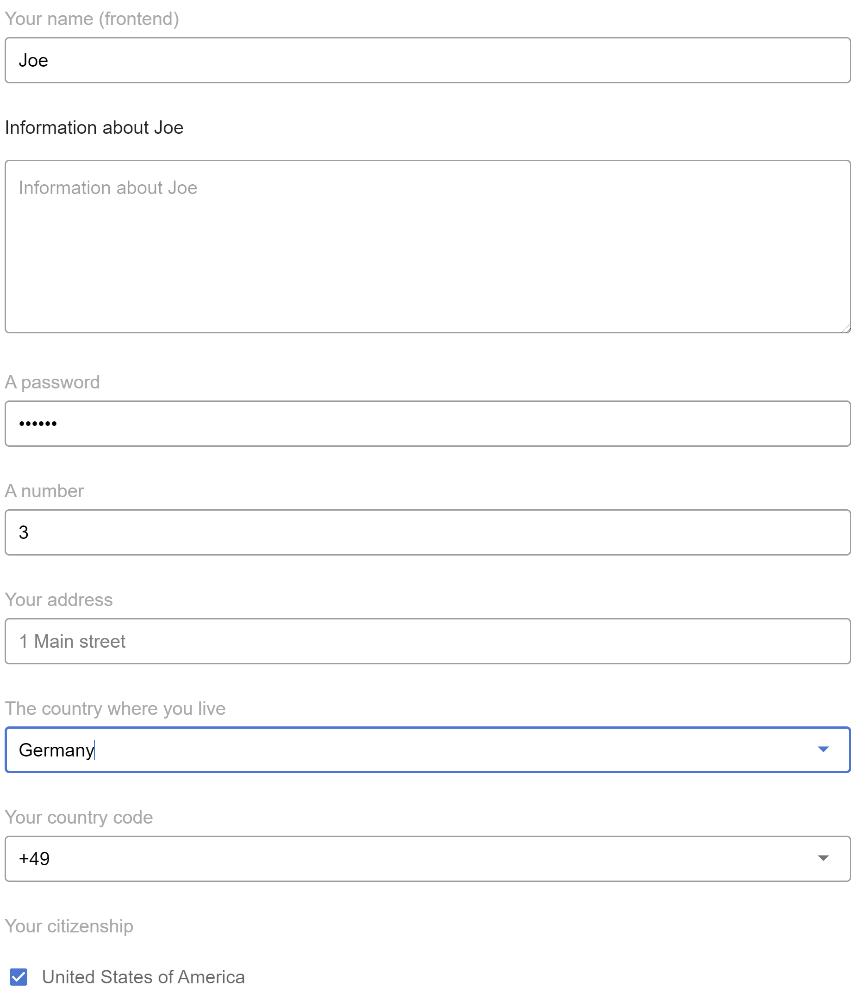

[](https://circleci.com/gh/SAP/inquirer-gui)
[](https://coveralls.io/github/SAP/inquirer-gui?branch=master)
[](https://lgtm.com/projects/g/SAP/inquirer-gui/context:javascript)
[](http://commitizen.github.io/cz-cli/)

[](https://api.reuse.software/info/github.com/SAP/inquirer-gui)
[](https://dependabot.com/)

# Inquirer GUI


## Description
`inquirer-gui` is a UI component that displays [Inquirer.js](https://github.com/SBoudrias/Inquirer.js)-compliant questions in an interactive HTML form.

## Requirements
* [node.js](https://www.npmjs.com/package/node) version 10 or higher.

## Installation and Usage
There are several use-cases for the consuming `inquirer-gui` component:
* You can use it in another Vue application or in a non-Vue application
* You can use it in a browser or in Visual Studio Code
* You can provide the questions in the frontend or in the backend (providing questions in the backend implies more flexibility in composing questions)

We provide examples for some of the above use-cases.

First, clone this directory:
```sh
git clone https://github.com/SAP/inquirer-gui
```

### Run in Browser (Frontend Questions)
Use the provided `sample-app`:
```sh
npm install
cd sample-app
npm install
npm run serve
```
This will run the web server on `localhost` on an available port. Open the provided link in the browser.
### Run in Browser (Backend Questions)
Use the provided `sample-app` and `websocket-server`:
```sh
npm install
cd websocket-server
npm install
```
If using Visual Studio Code, run the `WebSocket Server` debug configuration. This will start the sample WebSocket server that listens for requests on port `8081`.
```sh
cd sample-app
npm install
npm run serve
```
This will run the web server on `localhost` on an available port. Open the provided link in the browser.

### Usage
If writing a Vue application, simply add the following line to your `<template>` tag:
```html
   <Form ref="form" :questions="questions" @answered="onAnswered" />
```

The `questions` property is an [inquirer.js-compliant](https://github.com/SBoudrias/Inquirer.js/#questions) array of questions. E.g.:
```js
[
  {
    type: "input",
    name: "name",
    message: "Your name (frontend)",
    default: "Joe",
    validate: function (input) {
      if (input.length >= 2) {
        return true;
      } else {
            return "Name must be at least 2 characters long";
      }
    }
  }
]
```

The `answered` event is fired when any answer is changed:
* The first parameter to the event handler, `answers`, contains all answers.
* The second parameter, `issues`, can be used to, for example, enable or disable a `Next` button.

## Custom form elements
`inquirer-gui` provides *built-in form elements* for all built-in `inquirer.js` question types:
* `list`, `rawlist`
* `expand`
* `checkbox`
* `confirm`
* `input` (number, password and input)
* `editor`

`inquirer-gui` supports *custom form elements* via its `plugin` mechanism (see more [here](PLUGINS.md)).

### Creating a custom form element
A form element plugin is a `javascript` object with this structure:
```js
{
  questionType: '<inquirer-question-type>';
  component: <MyVueComponent>;
}
```

Where `questionType` is the string provided in the question's `type` property, and `component` is a `Vue` component that renders questions of the given type.

There is example of a custom form element in the `/sample-plugin` folder. It is defined as a `Vue plugin` and was published as `@sap-devx/inquirer-gui-date-plugin` on `npm`.

### Consuming a custom form element
Consume a custom form element as a `Vue plugin` using the `Vue.use()` method. The plugin is returned in the method's `options` parameter. For example, refer to `/sample-app/src/App.vue`:
```js
import DatePlugin from "@sap-devx/inquirer-gui-date-plugin";

const options = {};
// use the Vue plugin
Vue.use(DatePlugin, options);
// register the inquirer-gui plugin with your form instance
form.registerPlugin(options.plugin);
```

## How to obtain support
To get more help, support and information please open a github issue.

## Contributing
Contributing information can be found in the [CONTRIBUTING.md](CONTRIBUTING.md) file.
