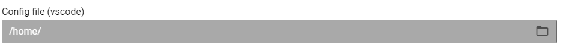

# File Browser Plugin for Inquirer-gui

This inquirer-gui plugin enables selecting a file from a backend.



It can be used in Visual Studio Code when working locally or in [remote development](https://code.visualstudio.com/docs/remote/remote-overview) or in [Theia](https://github.com/eclipse-theia/theia).

See the [sample-vscode-extension](https://github.com/SAP/inquirer-gui/tree/master/sample-vscode-extension) for useage.

### Sample Question

```js
  {
    type: "input",
    guiOptions: {
      type: "file-browser",
    },
    name: "configFile",
    message: "Config file (vscode)",
    default: "/home/",
    getFilePath: async function (currentPath) {
        return `${currentPath}subdir/`;
    }
  },
```
