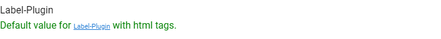

# Label Plugin for Inquirer-gui

This plugin presents a label (read-only).



## Installation

```sh
npm install --save @sap-devx/inquirer-gui-label-plugin
```

## Usage

- The `guiOptions` type property of the Inquirer.js question must be of type `label`.
- You must provide a `default` value or implement `default` function.
- Note that if your question is an Inquirer.js question or part of a Yeoman generator and the question is shown in a command-line interface (CLI), the `input` type will be shown instead.

### Sample Question

```js
{
    type: "input",
    guiOptions: {
      type: "label"
    },
    name: "label_example",
    message: "Label-Plugin",
    default: '<p style="color:green">Default value for <a href="https://github.com/SAP/inquirer-gui/tree/master/label-plugin">Label-Plugin</a> with html tags.</p>'
}
```
