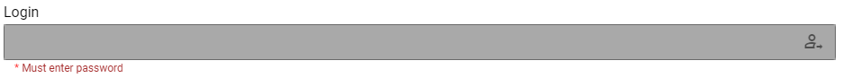

# Login Plugin for Inquirer-gui



This plugin presents a password prompt and enables logging in to a backend system.

### Sample Question

```js
  {
    type: "password",
    guiOptions: {
      type: "login",
    },
    name: "login",
    message: "Login",
    default: "",
    validate: async function (answer, answers) {
      if (!answer) {
        return "Must enter password"
      } else {
        // perform login
        return true;
      }
    }
  },
```
