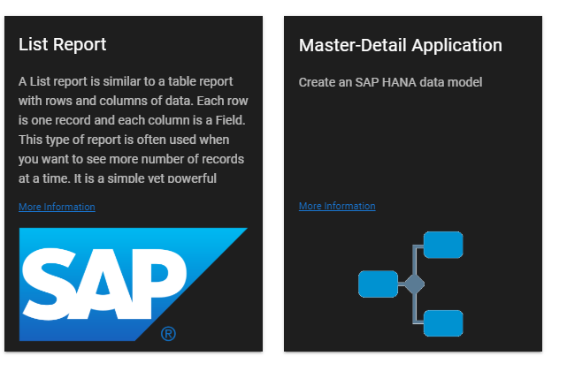

# Tiles Plugin for Inquirer-gui

This plugin presents selectable tiles (cards).



## Installation

```sh
npm install --save @sap-devx/inquirer-gui-tiles-plugin
```

## Usage

- The `guiOptions` type property of the Inquirer.js question must be of type `tiles`.
- Each choice of the `choices` member represents a single card.
- Typically, this would be a single question in a prompt. In this case, consider setting the `message` member to an empty string because the prompt's title sufficiently descirbes the question. However, note that if your question is an Inquirer.js question or part of a Yeoman generator and the question is shown in a command-line interface (CLI), the `name` member will be shown instead.

### Sample Question

```js
{
    name: "appType",
    message: "",
    type: "list",
    guiOptions: {
      type: "tiles"
    },
    choices: [
      { value: "listReport", name: "List Report", description: "A List report is similar to a table report with rows and columns of data. Each row is one record and each column is a Field. This type of report is often used when you want to see more number of records at a time. It is a simple yet powerful report type that can display any columns you want and in the required order.", homepage: "http://www.sap.com", image: SAP_IMAGE },
      { value: "masterDetail", name: "Master-Detail Application", description: "Create an SAP HANA data model " , homepage: "http://www.sap.com", image: WORKFLOW_IMAGE}
    ],
    default: "masterDetail"
}
```
