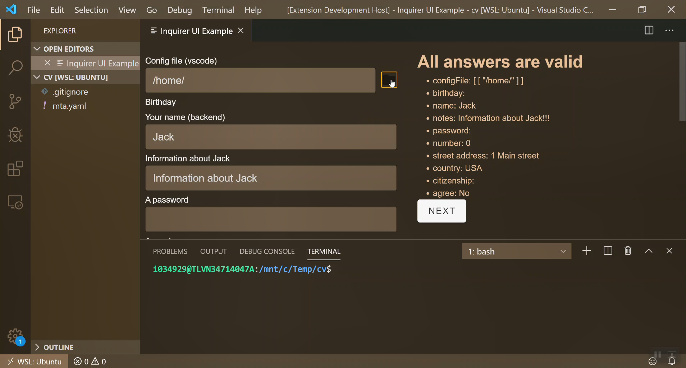

# sample-vscode-extension

[](inquirer-gui-vscode-browse-file.mp4 "Video of file browser")

## Requirements

You should first build the `sample-app` for production:
```sh
cd sample-app
npm run build
```

Then copy the `sample-app\dist` to this folder `sample-vscode-extension`.

Then launch the `Launch Extension` debug configuation.

